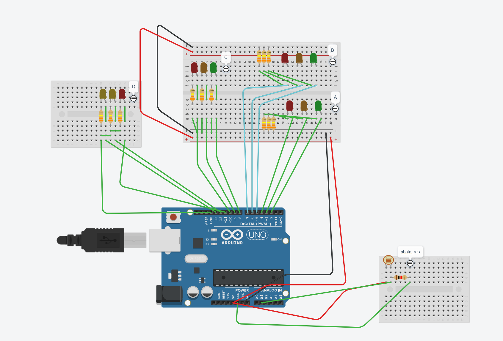

# Traffic Light Simulation

## Description
This code simulates a traffic light system that adjusts according to a day and night cycle. It operates based on a light sensor (connected to `pResistor`) to switch between day and night modes.

## Setup
### Components Used
- Arduino board
- Light sensor (connected to `pResistor`)
- LEDs for traffic lights (connected to appropriate pins)

## How It Works
The code functions as follows:
- Initializes pin modes for various LEDs and the light sensor in the `setup()` function.
- Reads the light sensor value in the `loop()` function and switches between day and night modes based on a threshold value (500 in this case).
- `dayMode()` function:
  - Activates the traffic lights in a sequence corresponding to a daytime cycle.
- `nightMode()` function:
  - Deactivates all traffic lights except for the yellow lights to simulate a nighttime scenario.

## Usage
1. Set up the circuitry as described in the Components Used section.
2. Upload the code to your Arduino board.
3. Ensure the light sensor is adequately exposed to light to trigger the day mode and covered to simulate night mode.
4. Monitor the serial monitor (baud rate: 9600) to observe the sensor values and corresponding mode changes.

## Note
- Adjust the sensor threshold value (`value > 500`) in the `loop()` function according to environmental lighting conditions for optimal performance.

This code was created in 2020.
